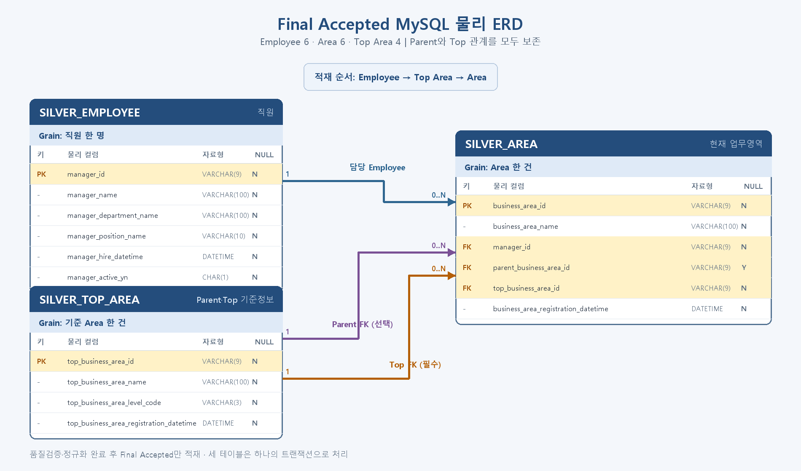

# MLO 1기 2차 프로젝트

## 1. 팀 소개

### 팀명
`mlo-01-p2-team1`

### 멤버
| 이름 | 역할 | github |
|---|---|---|
| 신동엽 | 팀장 | [sdyeob](https://github.com/sdyeob) |
| 신성민 | 팀원 | [gururr](https://github.com/gururr-lab)|
| 오재석 | 팀원 | [1ritaron8](https://github.com/1ritaron8)|
| 이인건 | 팀원 | [2eelogan](https://github.com/2eelogan) |

## 2. 프로젝트 개요

### 프로젝트명
AI 기반 레거시 데이터 표준화 및 오류 보정·추천 플랫폼

### 프로젝트 소개
서로 다른 시점에 수집되어 관리가 파편화된 레거시 데이터를 원형 그대로 안전하게 보관하면서, 데이터 구조와 연관 관계를 종합적으로 분석해 공통 데이터 모델로 재구성하는 프로젝트입니다.

수집된 데이터는 Delta Lake 기반의 Medallion 아키텍처를 따라 Bronze, Silver, Gold 레이어로 단계별 처리됩니다.

- Bronze: 원본 레거시 데이터와 메타데이터, 변경 이력을 손상 없이 원형 그대로 보존합니다.
- Silver: 컬럼명, 데이터 타입, 코드 및 식별자 체계를 표준화하고, 고도화된 품질 검증 파이프라인을 통해 정상적으로 정제된 데이터와 추가 검증·교정이 필요한 격리(Rejected) 데이터를 명확히 분류합니다.
- Gold: 검증을 마친 고품질 정제 데이터의 패턴을 분석하여, 격리된 데이터의 결측치(Null) 및 이상치(Error)에 대해 최적의 보정값을 자동으로 추론·추천할 수 있는 AI-Ready Data를 구축합니다.

본 프로젝트의 궁극적인 지향점은 기업이 디지털 전환(DX) 과정에서 확신을 갖고 활용할 수 있는 자율 교정형 데이터 관리 생태계를 조성하는 것입니다. 다만 이번 MVP 단계에서는 자동 승인 및 수정 완결 기능에 앞서, 레거시 데이터의 표준화·정규화 파이프라인 확립과 결측/오류 데이터에 대한 지능형 보정값 추천 기반을 견고히 다지는 데 초점을 맞춥니다.

### 프로젝트 배경
기업 내 축적된 레거시 데이터는 장기간 단절되어 관리되면서 누락된 값(Null), 오기입, 파편화된 표준 규격 등 심각한 품질 관리의 부재를 겪어왔습니다.

이로 인해 현업에서는 다음과 같은 페인 포인트(Pain Point)가 반복되고 있습니다.

데이터 내 불확실한 결측치와 이상치로 인해 데이터에 기반한 주요 의사결정의 신뢰성이 크게 흔들립니다.

분석이나 신규 시스템 구축, AI 모델 적용을 시도할 때마다 동일한 예외 처리와 비효율적인 수작업 정제 과정이 반복됩니다.

원천 데이터의 불완전성으로 인해 기업의 AI 및 DX 혁신 과제 도입 자체가 지연되거나 무산되는 결과를 초래합니다.

본 프로젝트는 원본 데이터의 안전성을 확보함과 동시에 표준 용어, 도메인, 명명 규칙을 체계적으로 수립합니다. 나아가 엄격한 검증 체계를 통과한 '정상 데이터'를 기반으로 오류·결측 영역의 '올바른 값'을 지능적으로 추론하고 제안함으로써, 별도의 수작업 정제 없이도 완결성 높은 데이터 자산을 확보할 수 있는 지속 가능한 DX 데이터 인프라를 제공합니다.

### 프로젝트 목표
- TBD

## 3. 기술 스택
| 구분 | 기술 |
|---|---|
| Language | Python, SQL |
| Database | MySQL, MongoDB |
| Collaboration | GitHub |

## 4. WBS
- TBD

## 5. 요구사항 명세서
- TBD

## 6. ERD

- 

## 7. 주요 프로시저
- 원본 데이터 및 메타 데이터, 백업 데이터를 Data Lake Storage(mongodb)에 적재 (Bronze)
- Data Lake Storage의 데이터를 가져와 표준화 및 정규화 처리 수행
- 데이터 정제 후 정상 데이터와 격리 데이터 분리
- 정제 완료된 데이터에 대한 재처리 방지 로직 추가

## 8. 수행결과(테스트/시연 페이지)
- TBD

## 9. 한 줄 회고

| 이름 | 회고 |
|---|---|
| 신동엽 | 어떻게 해야 협업을 더 잘할 수 있는지 고민해볼 수 있었던 좋은 시간이었습니다. 또한, 팀원들 각자에게 할당된 파트에 대해서 프로그래밍 한 뒤에, 하나의 호출 흐름으로 모을 수 있도록 계약을 잘 만드는게 얼마나 중요한지 느낄 수 있었습니다. |
| 신성민 | - |
| 오재석 | 중간중간에 수정을 하느라 작업이 예정된 것보다 계속 딜레이가 되어 완성도가 아쉽습니다. 초반 설계가 탄탄해야 하는것을 다시 느꼈습니다 |
| 이인건 | - |

## 10. PPT 링크
PPT 링크 : https://www.miricanvas.com/v2/ko/design2/v/7af26896-5dbc-41de-b1cc-70acdaa5403f
