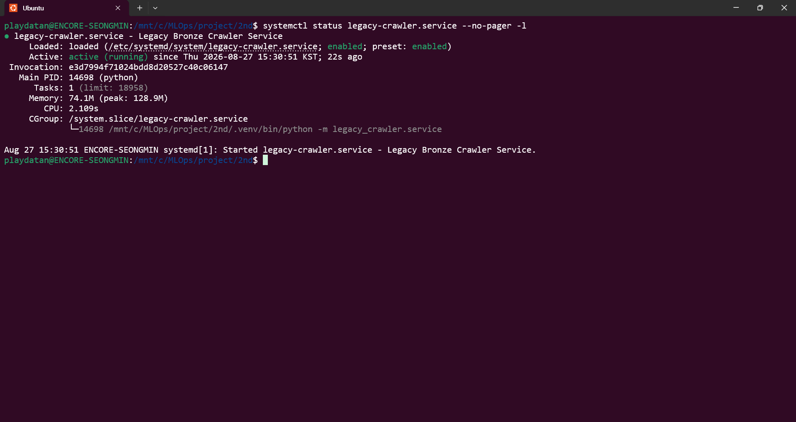
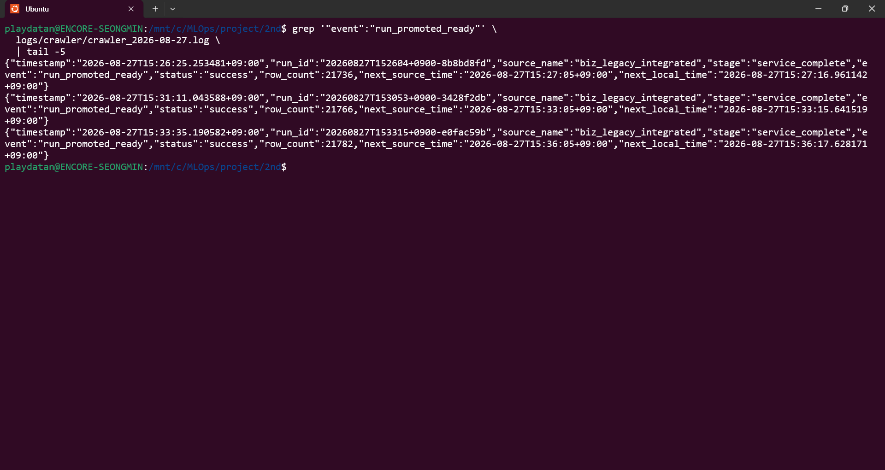

# Bronze 운영 매뉴얼

## 1. 운영 구성

WSL(Windows Subsystem for Linux, Windows용 Linux 하위 시스템)의 systemd가 Python foreground runner를 상시 실행한다.

```text
systemd legacy-crawler.service
→ python -m legacy_crawler.service
→ full collection
→ 파일 및 MongoDB staging validation
→ READY → READY production promotion
→ production 사후 validation
→ crawler_runs.state = ready
→ next_refresh_at + 5초 기반 대기
→ 다음 cycle 반복
```

현재 unit의 핵심 설정은 다음과 같다.

- unit: `/etc/systemd/system/legacy-crawler.service`
- working directory: `/mnt/c/MLOps/project/2nd`
- environment file: `/mnt/c/MLOps/project/2nd/.env`
- command: `.venv/bin/python -m legacy_crawler.service`
- `Restart=on-failure`, `RestartSec=10`
- `KillSignal=SIGTERM`, `TimeoutStopSec=120`
- boot target: `multi-user.target`

서비스는 enabled이며 `active (running)` 상태가 확인되었다.



## 2. 서비스 상태 확인

```bash
systemctl is-enabled legacy-crawler.service
systemctl is-active legacy-crawler.service
systemctl status legacy-crawler.service --no-pager -l
systemctl cat legacy-crawler.service
```

정상 기대값은 `enabled`, `active`다. status에서 실행 command가 프로젝트 `.venv/bin/python -m legacy_crawler.service`인지도 확인한다.

## 3. 자동 cycle

각 cycle은 `service.py`가 기존 모듈을 재사용해 수행한다.

1. `run_once(Settings.from_env())`가 metadata에서 정확한 dataset을 찾고 signed cursor의 마지막 `has_more=false`까지 수집한다.
2. HTTP(Hypertext Transfer Protocol, 하이퍼텍스트 전송 프로토콜) response body bytes를 페이지별 Raw JSON(JavaScript Object Notation, 자바스크립트 객체 표기법)으로 보존한다.
3. payload 15컬럼 exchange CSV(Comma-Separated Values, 쉼표 구분 값)와 wrapper 5개를 포함한 20컬럼 backup CSV를 만든다.
4. run별 staging에 full snapshot을 적재하고 파일·MongoDB 계약을 검증한다.
5. `promote_ready_to_ready()`가 현재 단일 READY production을 backup으로 rename하고 staging을 production으로 승격한다.
6. production 사후 검증을 통과한 run만 `crawler_runs.state=ready`와 `ready_at`을 기록한다.
7. 해당 cycle metadata에서 계산한 다음 실행시각까지 기다린다.

로그의 서로 다른 run_id에서 `event=run_promoted_ready`, `status=success`가 연속 확인되어 복수 자동 cycle 정상 운영이 검증되었다.



## 4. 다음 실행시각

`calculate_next_run()`은 metadata의 `server_time`과 `next_refresh_at`으로 source server와 local clock 차이를 계산한다. source 기준 목표는 항상 `next_refresh_at + 5초`다.

runner의 실제 대기시간은 다음 개념으로 매 cycle 다시 계산한다.

```python
wait_seconds = max(
    0,
    schedule.local_run_time.timestamp()
    - datetime.now().astimezone().timestamp(),
)
```

고정 3분 interval이나 systemd timer를 사용하지 않는다. systemd는 service process를 유지하고, metadata 기반 대기는 Python runner 내부에서 수행한다.

## 5. 수동 1회 실행

상시 서비스와 동시에 실행하지 않는다. 먼저 서비스가 중지된 통제된 환경인지 확인한 뒤 다음 명령으로 수집부터 READY 확인까지 한 cycle만 실행할 수 있다.

```bash
cd /mnt/c/MLOps/project/2nd
PYTHONPATH=src .venv/bin/python -m legacy_crawler.service --once
```

`--once`는 수집, staging 검증, READY→READY 승격, production 사후 검증, READY 확인 후 대기 없이 종료한다.

## 6. 수동 검증 및 승격 CLI

자동 runner와 별도로 candidate 검증만 수행할 수 있다.

```bash
PYTHONPATH=src .venv/bin/python -m legacy_crawler.promote \
  --run-id '<run_id>' \
  --run-dir '<파일 Bronze run 경로>' \
  --project-root '/mnt/c/MLOps/project/2nd' \
  --validate-only
```

일반 READY→READY 승격 CLI(Command-Line Interface, 명령줄 인터페이스)는 `--promote-ready`다. 자동 서비스가 실행 중인 상태에서 별도 수동 승격을 시작하지 않는다.

```bash
PYTHONPATH=src .venv/bin/python -m legacy_crawler.promote \
  --run-id '<검증 완료 candidate run_id>' \
  --run-dir '<파일 Bronze run 경로>' \
  --project-root '/mnt/c/MLOps/project/2nd' \
  --promote-ready \
  --promotion-time '<timezone 포함 ISO-8601 시각>' \
  --confirm-production legacy_records
```

`--promote-first-mixed`는 완료된 최초 migration 전용이다. 반복 운영에는 사용하지 않는다.

## 7. READY 확인

정상 cycle 뒤 다음을 모두 만족해야 한다.

- 최신 `crawler_runs.state=ready`
- production distinct `_ingest.run_id`가 정확히 1개
- production run_id와 최신 READY run_id가 일치
- distinct `_ingest.source_name`이 `biz_legacy_integrated` 하나
- document count와 distinct `record_id` count가 일치
- `uq_record_id`가 `{record_id: 1}`, `unique=true`
- `crawl_manifests.status=success`
- `crawl_manifests.mongodb_validation_status=pass`

서비스가 production을 계속 갱신하므로 run_id와 row count는 문서의 고정값이 아니라 MongoDB에서 동적으로 조회한다.

## 8. 동시 실행과 종료

- 수집 lock: `state/crawler.lock`
- 승격 lock: `state/promotion.lock`

systemd가 SIGTERM(Signal Terminate, 종료 신호)을 보내면 runner는 flag를 설정한다. 수집 후 승격 전 또는 승격 완료 후 안전 경계에서 정상 종료하며, production rename 중간에 별도 강제 종료를 일으키지 않는다. 승격 중 오류는 기존 rollback 보호가 처리한다.

lock이 남아 있으면 실제 process와 PID(Process Identifier, 프로세스 식별자)를 먼저 확인한다. 원인 확인 없이 lock을 삭제하지 않는다.

## 9. 로그와 재시작

- 일반 로그: `logs/crawler/crawler_YYYY-MM-DD.log`
- 오류 로그: `logs/errors/crawler_error_YYYY-MM-DD.log`
- systemd journal: `journalctl -u legacy-crawler.service`

```bash
journalctl -u legacy-crawler.service -n 100 --no-pager
grep '"event":"run_promoted_ready"' logs/crawler/crawler_YYYY-MM-DD.log | tail
```

cycle 실패는 성공이나 READY로 간주하지 않고 process를 non-zero로 종료한다. 무한 내부 retry는 없으며 systemd의 `Restart=on-failure`가 10초 뒤 process를 다시 시작한다. `systemctl restart legacy-crawler.service` 후에도 새 자동 cycle의 `run_promoted_ready` 성공이 확인되었다.

## 10. API Key와 인프라 주의사항

API(Application Programming Interface, 애플리케이션 프로그래밍 인터페이스) Key는 `/public/v1/key`에서 cycle마다 받아 memory에서만 사용한다. 환경 파일, MongoDB, 산출물, 표준 출력 또는 로그에 저장하지 않는다. logger는 secret field와 실제 key 값을 마스킹한다.

systemd unit 등록과 활성화는 완료되었지만 MongoDB 인증 사용자, 권한, bind address, 방화벽, WSL network 설정 변경은 이 crawler 구현 범위에서 수행하지 않았다. 해당 보안 항목은 별도 인프라 정책으로 관리한다.
