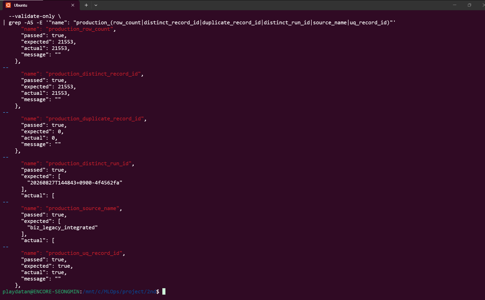

# MongoDB 데이터 계약

기본 database는 `legacy_bronze`, 원천 이름은 `biz_legacy_integrated`다.

## collection 계약

| collection | 역할 | 보존 정책 |
| --- | --- | --- |
| `legacy_records` | 팀이 조회하는 최신 READY full dataset | 단일 run만 유지 |
| `crawl_manifests` | 전체 run의 수집·검증·후속 pipeline 운영 manifest | run 이력 유지 |
| `crawler_runs` | 실행 상태, 건수, 검증 결과, 오류와 READY 시각 | run 이력 유지 |
| `legacy_records_staging_{safe_run_id}` | 승격 전 run별 full snapshot | 성공 시 rename, 실패 시 자동 삭제하지 않음 |
| `legacy_records_backup_{safe_old_run_id}` | 이후 승격에서 직전 단일 READY production rollback snapshot | 수동 승인 전 보존 |
| `legacy_records_backup_legacy_mixed_16runs_{timestamp}` | 최초 migration 직전 구형 mixed production snapshot | 과거 READY run을 뜻하지 않으며 수동 승인 전 보존 |

최초 migration backup의 현재 이름은 `legacy_records_backup_legacy_mixed_16runs_20260827T140300_0900`이다. 기존 16개 run 중 하나를 대표 run으로 지정하지 않으며 문서를 보정하지 않는다.

### crawl_manifests

파일 manifest를 기반으로 `run_id`, source와 파일 경로, `raw_artifacts`, 행·페이지 수, checksum, `status`, `pipeline_status`를 보존하고 실제 적재 뒤 `mongodb_validation_status`를 추가한 운영 문서다. `run_id`는 unique다. 후속 pipeline은 같은 문서의 `pipeline_status`만 승인된 방향으로 갱신한다.

### crawler_runs

`run_id`, `source_name`, `state`, `staging_collection`, `production_collection`, `expected_rows`, `inserted_rows`, validation 결과, 시작·검증·READY·실패 시각과 오류를 관리한다. 상태 전이는 수집 시 `loading → validating`, 검증 또는 실행 실패 시 `failed`, production 사후 검증 성공 시에만 `validating → ready`다.

### staging과 backup

staging 문서는 아래 `legacy_records` 계약과 동일하며 `_ingest.run_id`는 한 collection 안에서 모두 같아야 한다. staging에는 `uq_record_id`를 먼저 생성해 같은 snapshot의 중복을 차단한다. production 승격은 collection rename을 사용하므로 staging의 문서와 index가 함께 이동한다.

`promote_ready_to_ready()`는 현재 production의 단일 READY run과 `crawler_runs`의 최신 READY run 일치를 확인한 뒤 `legacy_records_backup_{safe_old_run_id}`로 보존하고 새 staging을 production으로 승격한다. backup은 rename 당시 production 문서와 index를 변경 없이 보존한다. 자동 retention이나 자동 삭제 scheduler는 없다.

## legacy_records 문서 구조

```json
{
  "record_id": 154001,
  "source_row_no": 251,
  "source_record_sha256": "...",
  "release_slot": 62,
  "scheduled_release_at": "...",
  "payload": {
    "mgr_nm": "...",
    "mgr_no": "...",
    "area_nm": "...",
    "area_no": "...",
    "p_area_nm": "...",
    "p_area_no": "...",
    "mgr_act_yn": "...",
    "mgr_pos_nm": "...",
    "mgr_dept_nm": "...",
    "top_area_nm": "...",
    "top_area_no": "...",
    "area_reg_dtm": "...",
    "mgr_hire_dtm": "...",
    "top_area_lvl": "...",
    "top_area_reg_dtm": "..."
  },
  "_ingest": {
    "run_id": "<current-ready-run-id>",
    "source_name": "biz_legacy_integrated",
    "collected_at": "<timezone-aware collected timestamp>"
  }
}
```

### wrapper 5개

`record_id`, `source_row_no`, `source_record_sha256`, `release_slot`, `scheduled_release_at`

### payload 15개

`mgr_nm`, `mgr_no`, `area_nm`, `area_no`, `p_area_nm`, `p_area_no`, `mgr_act_yn`, `mgr_pos_nm`, `mgr_dept_nm`, `top_area_nm`, `top_area_no`, `area_reg_dtm`, `mgr_hire_dtm`, `top_area_lvl`, `top_area_reg_dtm`

### 불변 규칙

원천 payload와 wrapper 값은 수정하지 않는다. `strip`, 공백 제거, 날짜 변환, NULL 치환, 대소문자 변경, 코드값 변환, payload flatten을 금지한다. `source_record_sha256` 알고리즘을 추측해 재생성하지 않고 API(Application Programming Interface, 애플리케이션 프로그래밍 인터페이스) 값과 MongoDB 저장값의 보존 여부만 비교한다. 레코드마다 `pipeline_status` 또는 표준화 상태를 반복 저장하지 않는다.

## index

staging과 승격된 production의 승인된 업무 index는 하나다.

```javascript
db.legacy_records.createIndex(
  { record_id: 1 },
  { unique: true, name: "uq_record_id" }
)
```

실제 production은 `_id_`와 `uq_record_id`를 가진다. 임의의 추가 index를 만들지 않는다.

`crawler_runs`는 unique `uq_run_id`와 조회용 `ix_source_state_ready`, `crawl_manifests`는 unique `uq_run_id`를 사용한다.

## 상태 계약

| 필드 | 허용값 | 의미 |
| --- | --- | --- |
| `manifest.status` | `success`, `partial_failure`, `failed` | Bronze 수집 결과 |
| `mongodb_validation_status` | `pass`, `fail` | MongoDB 적재 검증 결과 |
| `pipeline_status` | `pending`, `pass` | 후속 정규화·표준화 및 해당 단계 검증 완료 여부 |
| `crawler_runs.state` | `loading`, `validating`, `ready`, `failed` | 현재 run의 수집·검증·공개 운영 상태 |

`ready`와 `pipeline_status=pass`는 같은 의미가 아니다. `ready`는 Bronze production 공개와 사후 검증이 끝났다는 뜻이고, `pipeline_status=pass`는 후속 정규화·표준화까지 완료됐다는 뜻이다. 따라서 정상적으로 READY인 최신 run의 `pipeline_status`가 `pending`일 수 있다.

## manifest 계약

파일 `manifest.json`은 수집 당시 불변 증빙이다. 파일에는 `pipeline_status=pending`이 기록되고 후속 처리가 끝나도 수정하지 않는다. 실제 MongoDB 검증 전에는 `mongodb_validation_status=pass`를 파일에 쓰지 않는다.

MongoDB `crawl_manifests`는 운영용 확장 manifest다. Bronze 적재 검증 후 `mongodb_validation_status=pass|fail`을 기록하며, 후속 파이프라인 완료 시 동일 `run_id` 문서의 `pipeline_status`만 `pending → pass`로 변경할 수 있다. 다른 pipeline 상태값은 추가하지 않는다.

## production 불변 조건

- document count와 distinct `record_id` count가 같아야 한다.
- duplicate `record_id`가 0이어야 한다.
- distinct `_ingest.run_id`가 정확히 1이어야 한다.
- distinct `_ingest.source_name`이 `biz_legacy_integrated` 하나여야 한다.
- 최신 `crawler_runs.state=ready`의 `run_id`와 production `_ingest.run_id`가 같아야 한다.

상시 서비스가 production을 반복 갱신하므로 특정 run_id나 row count를 데이터 계약으로 고정하지 않는다. 아래 화면은 한 시점의 production row count, distinct `record_id`, duplicate 0, 단일 run_id/source와 `uq_record_id` 검증이 모두 PASS였음을 보여주는 증빙이며 현재값 조회를 대체하지 않는다.


