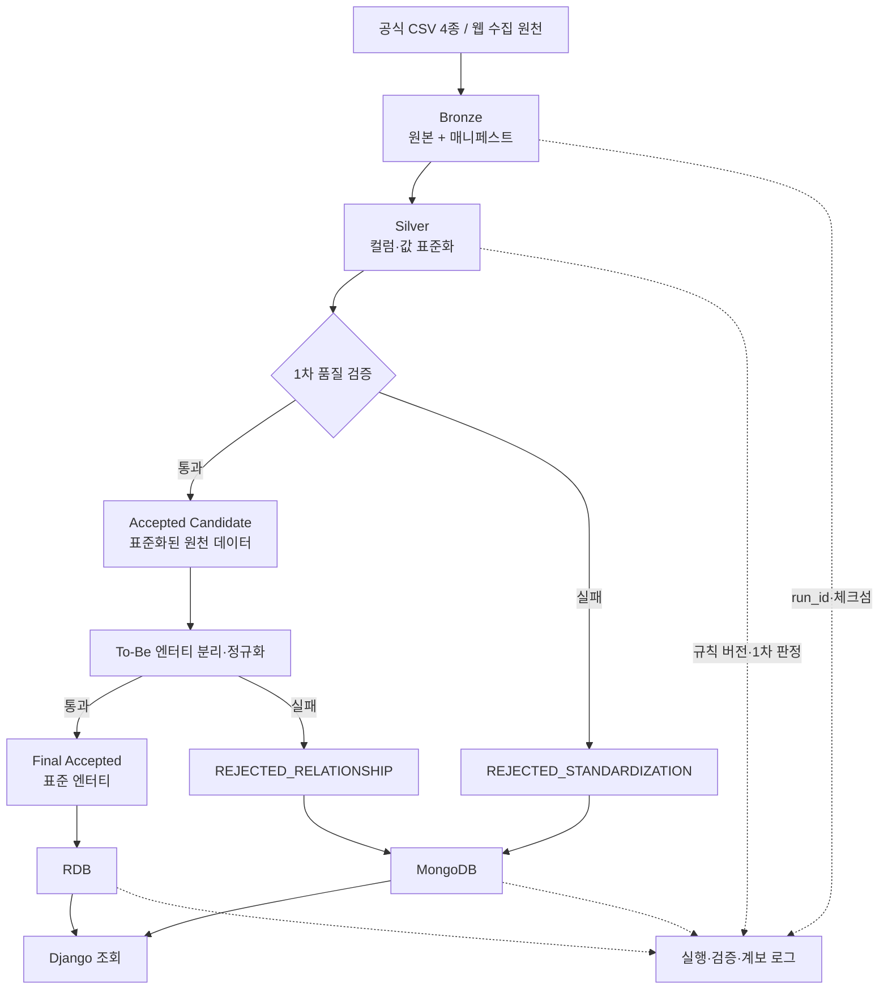

# PRD — DX 전환을 위한 조직·구성원 데이터 표준화 및 품질 진단

> - 상태: 초안 v0.3
> - 기준 문서: BRD v0.3, 데이터 표준화 및 AI Ready Data 구축 프로젝트 가이드, AS-IS/TO-BE 분석 세부 작업 리스트
> - 대상 기간: 2026-08-27 ~ 2026-08-28
> - 범위: Medallion 아키텍처의 Bronze·Silver 논리 레이어 및 결과 조회 서비스
> - 제외: Gold 레이어, AI 피처 생성·모델 학습·추천 및 자동 보정
> - 문서 유형: 제품 요구사항·산출물·수용 기준 명세

## 1. 제품 개요

### 1.1 제품 목표

본 제품은 레거시 조직·구성원 데이터를 회차별로 원본 보존(Bronze)하고 합의된 표준 사전과 품질 규칙으로 표준화·1차 검증한다. 1차 검증을 통과한 데이터를 To-Be 엔터티로 분리·정규화하고 관계 무결성까지 검증하여 DX 전환에 사용할 수 있는 Final Accepted 데이터와 개선이 필요한 Rejected 데이터로 구분해 제공한다.

제품은 원천값의 업무적 사실성을 추정하거나 임의로 수정하지 않는다. 근거가 있는 표현·형식 차이만 표준화하며, 기본 품질 오류는 `REJECTED_STANDARDIZATION`, 엔터티 추출·PK·FK·관계 오류는 `REJECTED_RELATIONSHIP`으로 구분하여 품질 이슈와 함께 남긴다.

### 1.2 사용자와 해결 과제

| 사용자 | 해결할 과제 | 제공 결과 |
| --- | --- | --- |
| DX 전환 담당자 | 전환 가능한 데이터 범위와 개선 우선순위 판단 | Accepted Candidate·Final Accepted·Rejected 비율, 단계별 이슈 분포 |
| 조직·인사 데이터 담당자 | 표준명·도메인·관계에 대한 합의와 검토 | 표준 사전, Legacy→표준 매핑, 검증 근거 |
| 데이터·IT 운영 담당자 | 원천부터 결과까지 재현 가능한 실행 관리 | Bronze 원본, 매니페스트, 실행·검증·계보 로그 |
| 내부 검토 사용자 | 표준 데이터와 단계별 오류 데이터를 구분하여 조회 | Django 조회 화면, RDB Final Accepted, MongoDB 품질 이슈 |

### 1.3 성공 기준

Accepted Candidate 비율과 Final Accepted 비율은 원천 품질과 To-Be 모델 적합성을 보여주는 진단값이며 성공 목표가 아니다. 제품 성공은 다음 기준으로 판단한다.

| 지표 | 목표 |
| --- | ---: |
| 공식 CSV 4종 기준선 재현율 | 100% |
| Bronze 원본 데이터·매니페스트 필수 항목 완전성 | 100% |
| Silver 입력의 `ACCEPTED_CANDIDATE` 또는 `REJECTED_STANDARDIZATION` 판정률 | 100% |
| 엔터티 후보의 Final Accepted 또는 모델·관계 Rejected 판정률 | 100% |
| Final Accepted의 표준·정규화·관계 규칙 준수율 | 100% |
| Rejected 이슈의 원본·필드·관계·규칙·사유 추적률 | 100% |
| 최종 결과의 원천 실행 역추적률 | 100% |
| 미분류 오류 비율 | 0% |

## 2. 범위 및 입력 데이터

### 2.1 범위

#### In-Scope

- 공식 CSV 4종의 인벤토리, AS-IS 프로파일링 및 품질 기준선
- 프로젝트 기간 동안 합의된 웹 원천의 3분 간격 반복 수집
- 회차별 원본 데이터·매니페스트를 포함하는 Bronze 저장
- 16개 고유 필드에 대한 표준 단어·용어·도메인·명명·매핑 규칙
- Silver 표준화, 1차 품질 검증, `ACCEPTED_CANDIDATE`·`REJECTED_STANDARDIZATION` 판정
- Accepted Candidate의 To-Be 엔터티 분리·정규화 및 관계 무결성 검증
- Final Accepted 엔터티의 RDB 적재와 단계별 Rejected·이슈의 MongoDB 적재
- Django 기반 결과 조회, 실행 로그·검증 결과·계보 제공

#### Out-of-Scope

사업 범위 제외 항목은 BRD의 `6.2 Out-of-Scope`를 따르며, 다음 구현은 현재 제품 범위에 포함하지 않는다.

- Gold 레이어, 분석 마트, AI Ready 피처 및 모델 학습·추론
- 근거 없는 값 보정, 수정 후보 추천 및 사용자 승인 워크플로
- 원천 시스템 자동 반영, 실시간 양방향 연동 및 상시 운영·고가용성
- 프로젝트 중 원천 스키마 변화에 따른 규칙 자동 재설계

### 2.2 공식 입력 데이터 계약

다음 CSV 4종을 표준 사전 구축과 품질 검증의 공식 기준 입력으로 사용한다.

| 원천 파일 | 기준 행 수 | 컬럼 수 | 처리 목적 |
| --- | ---: | ---: | --- |
| `biz_employee_master.csv` | 3,000 | 6 | 직원 마스터와 관리자 참조 검증 |
| `biz_meta_area_50000.csv` | 50,000 | 5 | 업무 영역 마스터 |
| `biz_meta_area_join_ready.csv` | 50,000 | 9 | 표준화 후 조인 결과 대조 |
| `biz_meta_area_parent_lookup.csv` | 1,000 | 4 | 상위 영역 및 계층 관계 검증 |
| **합계** | **104,000** | **24** | 파일별 컬럼 수 합계 |

파일 간 중복 컬럼을 제거한 공식 분석 대상은 16개 고유 필드이다. 구현 시 다음 항목을 확인한다.

- 파일 존재 여부와 SHA-256 체크섬
- 실제 행·컬럼 수와 기준값의 일치 여부
- 16개 고유 필드의 프로파일링 및 표준 매핑 상태
- 관계 후보의 참조 성공·실패 현황
- 표준화 후 조인 결과와 대조 데이터의 일치 여부

`biz_legacy_integrated.csv`는 공식 평가 집계와 분리된 확장 검증 입력으로 관리한다. 이 파일을 공식 범위에 편입하려면 인벤토리, 기준 행 수, 표준 사전 및 품질 규칙을 함께 개정해야 한다.

## 3. 목표 아키텍처와 책임 경계



### 3.1 처리 상태 정의

| 상태 | 의미 | 다음 처리 |
| --- | --- | --- |
| `STANDARDIZING` | Bronze 원천에 컬럼·값 표준화 규칙 적용 중 | 1차 품질 검증 |
| `ACCEPTED_CANDIDATE` | 표준화 및 1차 품질 검증을 통과한 원천 행 | 엔터티 분리·정규화 |
| `REJECTED_STANDARDIZATION` | 스키마·필수값·타입·날짜·도메인 등 기본 품질 검증 실패 | MongoDB 적재 |
| `NORMALIZING` | Accepted Candidate에서 To-Be 엔터티와 관계 추출 중 | 모델·관계 검증 |
| `FINAL_ACCEPTED` | PK·FK·중복·관계 검증까지 통과한 최종 엔터티 | RDB 적재 |
| `REJECTED_RELATIONSHIP` | 엔터티 추출, PK·FK 또는 관계 무결성 검증 실패 | MongoDB 적재 |

`Accepted Candidate`는 최종 RDB 적재 승인을 의미하지 않는다. 정규화와 관계 무결성 검증까지 통과한 `Final Accepted`만 RDB 적재 대상이 된다.

### 3.2 레이어와 저장소의 책임

| 구분 | 저장 대상 | 목적 |
| --- | --- | --- |
| Bronze | Raw CSV, `manifest.json` | 수집한 원본과 수집 정보를 변경 없이 저장 |
| Silver | Accepted Candidate, 정규화 엔터티 후보, 단계별 Rejected 및 검증 결과 | 표준화·정규화·검증된 중간 및 최종 처리 결과 저장 |
| RDB | Final Accepted 엔터티 | Django에서 조회할 표준 데이터를 관계형 구조로 저장 |
| MongoDB | Rejected 레코드와 품질 이슈 | 실패 단계·필드·관계·사유를 조회할 수 있도록 저장 |


> Bronze와 Silver 결과는 run_id로 실행 회차와 연결한다. RDB와 MongoDB의 결과에서도 해당 run_id를 통해 원천 데이터와 처리 결과를 역추적할 수 있어야 한다.


## 4. 사용자 흐름 및 기능 요구사항

### 4.1 수집 및 Bronze 저장

1. crontab 스케줄러가 3분마다 수집 작업을 호출한다.
2. 실행기는 수집 대상·범위와 고유 `run_id`를 등록한다.
3. 크롤러가 원본을 수집한다. 웹 수집은 API 키를 환경 변수로 주입하고 타임아웃과 원천별 호출 제한을 준수한다.
4. 이전 실행이 끝나지 않은 경우 다음 실행은 병렬로 시작하지 않고 건너뜀 상태와 사유를 기록한다.
5. 원본을 변형하지 않은 채 신규 `run_id` 경로에 저장하고 SHA-256 체크섬을 계산한다.
6. 매니페스트와 크롤링 상태를 기록한다. 일부 대상 실패는 `PARTIAL_FAILURE`, 필수 대상 전체 누락은 `FAILED`로 기록한다.
7. Bronze 유효성 검사 후 Silver 실행 후보로 전달한다.

권장 경로는 다음과 같다.

```text
data/bronze/{source_name}/ingest_date=YYYY-MM-DD/run_id={run_id}/
├── raw/{original_file}
└── manifest.json
```

Bronze 매니페스트는 최소 다음 정보를 포함한다.

| 필드 | 설명 |
| --- | --- |
| `run_id` | 실행 회차 식별자 |
| `source_name`, `source_uri` | 원천 식별자와 위치 |
| `collected_at`, `ingest_date` | 실제 수집 시각과 수집 일자 |
| `raw_path`, `content_type`, `file_size_bytes` | 저장 원본 정보 |
| `checksum_sha256` | 원본 무결성 체크섬 |
| `retry_count`, `http_status` | HTTP 수집 결과 |
| `crawler_version` | 수집 코드 버전 |
| `crawl_status`, `failure_reason` | 크롤링 성공·부분 실패·실패 상태와 사유 |

### 4.2 AS-IS 분석 및 표준 사전 구축

AS-IS 분석은 표준화 이전의 발견 사실을 남기며 이후 Silver 규칙과 TO-BE 모델의 근거가 된다.

| 산출물 | 목적 | 최소 내용 |
| --- | --- | --- |
| `as_is_profile.json` | 기계 판독 가능한 프로파일링 결과 | 파일·컬럼별 행 수, 타입, Null, 고유값, 패턴, 중복 |
| `legacy_columns_research.csv` | 컬럼 분석 | 원천 시스템, Legacy 컬럼, 예시값, 설명, 이슈 |
| `standard_words.csv` | 표준 단어 사전 | 안정 ID, 한글·영문 단어, 허용 약어, 정의, Legacy 표현 |
| `domain_rules.yaml` | 도메인 규칙 | 도메인 ID, 타입, 길이·형식, 허용값, 변환 규칙 |
| `naming_rules.yaml` | 명명 규칙 | 언어, `snake_case`, 물리명 패턴, 구분자, 약어 기준 |
| `standard_terms.csv` | 표준 용어·매핑 | 논리·물리명, 단어 ID, 정의, 도메인, Null 여부, Legacy 컬럼 |
| `source_to_standard_mapping.csv` | 원천별 컬럼 매핑 | 원천 컬럼, 표준 컬럼, 매핑 상태와 근거 |

Silver 표준화는 승인된 위 규칙 파일만을 기준으로 수행한다. 세부 컬럼 매핑과 변환값은 산출물에서 관리하며 PRD에 중복 정의하지 않는다.

모든 실행 회차에는 하나의 `rule_version`을 적용한다. 승인된 규칙에 없는 값은 임의로 변환하거나 보정하지 않으며, 미매핑 또는 판단 불가 사유를 기록한다.

### 4.3 Silver 표준화 및 품질 검증

각 Bronze 입력 행은 승인된 규칙으로 표준화한 후 기본 품질 검증을 거친다. 이 단계의 통과 결과는 최종 Accepted가 아니라 `Accepted Candidate`다. 기본 품질 검증을 통과하지 못한 행은 `REJECTED_STANDARDIZATION`으로 분류한다.

| 순서 | 처리 | 산출물 |
| ---: | --- | --- |
| 1 | Bronze 원본 파싱과 파일·스키마 검증 | 입력 행, 파싱·스키마 이슈 |
| 2 | 컬럼명 매핑과 문자열·식별자·날짜·논리값 표준화 | 표준화 후보 행 |
| 3 | 필수값·타입·날짜·도메인·식별자 매핑 검증 | 규칙별 1차 검증 결과 |
| 4 | 1차 통과 행 분류 | `accepted_candidate_rows.csv` |
| 5 | 1차 실패 행과 필드 이슈 분류 | `rejected_standardization_rows.csv`, 품질 이슈 |
| 6 | 원천 행 기준 1차 판정 완결성 검증 | 1차 실행 요약·검증 로그 |

#### 품질 게이트

| 검증 항목 | Accepted Candidate 수용 기준 | 실패 상태·코드 |
| --- | --- | --- |
| 행 수 | Bronze 입력 행과 1차 판정 결과를 대사할 수 있음 | 미대사 시 실행 실패 |
| 스키마 | 필수 컬럼이 존재하고 파싱 가능 | `REJECTED_STANDARDIZATION`·`SCHEMA_MISMATCH` |
| 필수값 | 기본 필수 필드 결측 0건 | `REJECTED_STANDARDIZATION`·`MISSING_REQUIRED` |
| 타입·날짜 | 표준 타입과 날짜 변환 실패 0건 | `REJECTED_STANDARDIZATION`·`INVALID_TYPE`, `INVALID_DATE_FORMAT` |
| 도메인 | 승인된 허용값 밖의 값 0건 | `REJECTED_STANDARDIZATION`·`DOMAIN_VIOLATION` |
| 식별자 | 표준 식별자 매핑 실패·충돌 0건 | `REJECTED_STANDARDIZATION`·`IDENTIFIER_MAPPING_FAILED`, `IDENTIFIER_COLLISION` |

1차 건수 정합성은 다음 식으로 검증한다.

```text
Silver 입력 행 수
= Accepted Candidate 행 수 + REJECTED_STANDARDIZATION 행 수
```

### 4.4 To-Be 엔터티 분리·정규화·최종 판정 및 RDB 적재

AS-IS의 Grain, 표준 용어와 관계 검증 결과를 근거로 To-Be 모델을 확정하고, Accepted Candidate를 엔터티별로 분리·정규화한다.

1. `brd.md`에서 데이터 활용 목적과 엔터티 분리 원칙을 확정한다.
2. `entity_candidates.csv`에서 관리 대상 엔터티와 단순 속성을 구분한다.
3. `identifier_decisions.csv`에서 후보 키의 유일성·최소성·안정성·Not Null 근거를 검토한다.
4. 개념→논리→물리 모델을 작성하고 1NF·2NF·3NF 검토 결과를 기록한다.
5. Accepted Candidate 한 행에서 Employee, Area 및 필요한 관계 후보를 추출한다.
6. 엔터티 후보별 PK·업무키 중복, FK orphan, 자기참조 계층과 조인 대조 결과를 검증한다.
7. 기준 원천·시점이 승인되지 않은 `REG_DT`는 임의 선택하지 않는다.
8. 모델·관계 검증을 통과한 엔터티만 `FINAL_ACCEPTED`로 확정한다.
9. 엔터티 추출·PK·FK·관계 검증에 실패한 후보는 `REJECTED_RELATIONSHIP`으로 분류한다.
10. DDL을 생성하고 Final Accepted 엔터티를 트랜잭션 단위로 대상 RDB에 적재한다.
11. 확정된 PK·업무키를 기준으로 신규 엔터티는 삽입하고 반복 관측된 기존 엔터티는 승인된 최신 상태 반영 규칙에 따라 갱신한다.
12. 입력·삽입·갱신·건너뜀·실패 건수를 엔터티 유형별로 기록한다.


초기 논리 모델은 다음 엔터티를 기준으로 하며 실제 속성과 키는 표준 사전과 프로파일링 결과로 확정한다.

- Employee Grain: 직원 한 명. `employee_id`는 안정적 PK 후보이다.
- Area Grain: 업무 영역 한 건. `area_id`는 PK 후보이며, `parent_area_id`는 Area 자기참조 FK, `manager_employee_id`는 Employee FK이다.
- `join_ready`와 `parent_lookup`은 기준·대조 입력으로 사용한다. 별도 마스터 엔터티 적재 여부는 중복·변경 이력·업무 독립성 분석 후 결정한다.

공식 CSV 4종은 입력 역할과 검증 기준을 정의하며 To-Be 물리 테이블 수를 고정하지 않는다. 원천 파일 4종을 그대로 네 개의 기준 테이블로 복제하는 것만으로는 정규화로 보지 않는다. To-Be 테이블은 Grain, 함수적 종속성, 중복과 관계 분석으로 확정하고, `join_ready` 및 `parent_lookup`은 분석 결과에 따라 검증 입력, 조회 View 또는 독립 엔터티 중 하나로 결정한다.

#### 모델·관계 품질 게이트

| 검증 항목 | Final Accepted 수용 기준 | 실패 상태·코드 |
| --- | --- | --- |
| 엔터티 추출 | 필수 엔터티 키와 속성을 생성할 수 있음 | `REJECTED_RELATIONSHIP`·`ENTITY_EXTRACTION_FAILED` |
| PK | 엔터티별 PK 누락·비정상 중복 0건 | `REJECTED_RELATIONSHIP`·`DUPLICATE_BUSINESS_KEY` |
| FK | 관리자·상위 영역 참조 orphan 0건 | `REJECTED_RELATIONSHIP`·`FOREIGN_KEY_ORPHAN` |
| 계층 관계 | 자기참조 순환·계층 모순 0건 | `REJECTED_RELATIONSHIP`·`HIERARCHY_CONFLICT` |
| 조인 대조 | `join_ready` 기준 불일치 0건 또는 승인 예외 존재 | `REJECTED_RELATIONSHIP`·`JOIN_REFERENCE_MISMATCH` |
| 기준 불명확 | 기준 원천·시점 미승인 값 없음 | `REJECTED_RELATIONSHIP`·`AMBIGUOUS_REFERENCE_DATE` |

한 개의 원천 행에서 여러 엔터티 후보가 생성될 수 있으므로 Raw 행 수와 RDB 행 수를 직접 비교하지 않는다. 모델 단계의 건수 정합성은 엔터티 유형별로 다음 식을 검증한다.

```text
엔터티 후보 발생 건수
= Final Accepted 판정 건수 + REJECTED_RELATIONSHIP 판정 건수
```

서로 다른 `run_id`에서 동일 개체가 반복 관측되는 것은 중복 오류가 아니다. 중복 검사는 실행 회차와 엔터티의 확정된 비즈니스 키 범위에서 수행하며, RDB에서는 동일 개체를 중복 생성하지 않는다. 여러 Final Accepted 판정이 동일 엔터티로 upsert될 수 있으므로 Final Accepted 판정 건수와 최종 RDB 행 수는 별도로 기록한다.

RDB 연결·트랜잭션·제약 적용 중 발생한 기술 오류는 데이터 품질 Rejected로 변경하지 않고 파이프라인 적재 오류로 기록한다.

### 4.5 Rejected 및 품질 이슈 관리

Rejected는 단순 실패 파일이 아니라 DX 전환의 개선 대상을 설명하는 제품 결과다. 표준화·1차 품질 오류와 엔터티·관계 오류를 구분하고, 하나의 원천 행 또는 엔터티 후보가 여러 이슈를 가질 수 있도록 Rejected 레코드와 이슈를 논리적으로 분리하여 저장한다.

| 컬렉션·논리 객체 | 필수 속성 |
| --- | --- |
| `rejected_records` | `rejection_id`, `run_id`, `rejection_stage`, 원천명, 원천 레코드 키·행 번호, 엔터티 유형·키, Raw payload, 표준화 후보, 상태, 판정 시각 |
| `quality_issues` | `issue_id`, `rejection_id`, 필드·관계명, 원본값, 표준 필드, 규칙 ID·버전, 실패 유형, 사유, 치명도 |
| `processing_runs` | `run_id`, 원천 행·Accepted Candidate·Final Accepted·단계별 Rejected 건수, 규칙·코드 버전, 시작·종료 시각, 상태, 로그 위치 |

`rejection_stage`는 `STANDARDIZATION` 또는 `RELATIONSHIP` 값을 가진다. MongoDB 조회는 실행 회차, 판정 단계, 원천, 엔터티, 레코드 키, 실패 필드·관계와 실패 유형으로 필터링할 수 있어야 한다.

MongoDB 연결·쓰기 오류는 원천 데이터 품질 이슈로 기록하지 않고 파이프라인 적재 오류로 구분한다.

### 4.6 Django 조회 화면

| 화면 | 주요 기능 | 완료 기준 |
| --- | --- | --- |
| 실행 목록 | 회차별 크롤링·파이프라인 상태, 원천 행·Accepted Candidate·Final Accepted·단계별 Rejected 건수 조회 | `run_id`별 단계별 처리 요약과 로그 위치 표시 |
| 처리 단계 요약 | 1차 통과율, 표준화 실패, 모델·관계 실패 및 Final Accepted 분포 | 판정 단계별 건수와 이슈 분포 확인 |
| Final Accepted 데이터 | Employee·Area 조회, 키워드·상태·상위 영역 필터 | RDB의 정규화 엔터티와 계보 정보 조회 |
| Rejected·이슈 | 원본값, 판정 단계, 엔터티, 실패 필드·관계·규칙·사유 필터 | 표준화 실패와 모델·관계 실패를 구분하고 이슈를 함께 확인 |
| 계보 상세 | Final Accepted와 단계별 Rejected에서 Bronze 원본·매니페스트·규칙 버전과 생성 엔터티까지 이동 | `run_id`와 원천 레코드 식별자로 원천 행과 파생 엔터티를 역추적 |

## 5. 상세 요구사항 및 수용 기준

| ID | 요구사항 | 수용 기준 |
| --- | --- | --- |
| PRD-01 | 공식 CSV 4종을 입력 기준 데이터로 관리한다. | 파일·행 수 합계 104,000과 16개 고유 필드 기준이 인벤토리에 기록된다. |
| PRD-02 | 웹 수집은 crontab으로 3분마다 실행하고 회차별 원본을 보존한다. | 각 실행에 고유 `run_id`, 실제 수집 시각과 크롤링 상태가 기록된다. |
| PRD-03 | Bronze는 원본을 변경하지 않는다. | 원본·체크섬·매니페스트가 동일 `run_id`로 연결되고 덮어쓰기가 없다. |
| PRD-04 | 모든 Legacy 컬럼에 표준화 적용 여부를 판정한다. | Coverage 검증에서 매핑·단어·도메인·명명 규칙 상태가 확인된다. |
| PRD-05 | Silver는 모든 원천 행을 Accepted Candidate 또는 `REJECTED_STANDARDIZATION`으로 1차 판정한다. | Silver 입력 행 수와 두 1차 판정 결과의 합이 일치하고 미판정 행이 0건이다. |
| PRD-06 | 판단 불가 값은 임의 보정하지 않는다. | Rejected에 판정 단계, 원본값, 규칙, 실패 유형과 사유가 보존된다. |
| PRD-07 | Accepted Candidate를 To-Be 업무 엔터티와 관계로 분리한다. | 각 후보에서 생성된 엔터티 유형·키와 원천 행의 연결 정보가 기록된다. |
| PRD-08 | 분리된 엔터티를 정규화하고 PK·FK·관계 무결성을 검증한다. | 엔터티 후보가 `FINAL_ACCEPTED` 또는 `REJECTED_RELATIONSHIP`으로 판정되고 미판정 후보가 0건이다. |
| PRD-09 | 조인 결과를 기준 데이터와 대조한다. | `join_ready` 불일치가 0건이거나 승인된 예외와 근거가 검증 로그에 남는다. |
| PRD-10 | 단계별 Rejected와 품질 이슈를 조회할 수 있다. | MongoDB에 `rejection_stage`와 레코드·이슈가 저장되고 화면 필터가 동작한다. |
| PRD-11 | Final Accepted만 정규화 RDB에 적재한다. | 적재 전후 PK 중복·FK orphan·필수값·도메인 위반이 0건이며 Accepted Candidate는 직접 적재되지 않는다. |
| PRD-12 | 결과는 원천까지 역추적할 수 있다. | Final Accepted·Rejected 상세에서 원천, `run_id`, Raw 경로, 규칙 버전과 파생 엔터티를 확인할 수 있다. |
| PRD-13 | Django에서 처리 단계별 결과를 구분해 조회한다. | Accepted Candidate 건수, Final Accepted 엔터티와 두 Rejected 단계의 이슈를 각각 확인할 수 있다. |

### 5.1 실행 검증 결과 계약

`run_validation.json`은 각 처리 단계의 입력·판정·적재 건수를 별도로 기록해야 한다.

| 필드 | 의미 |
| --- | --- |
| `silver_input_rows` | Silver 1차 판정 대상 원천 행 수 |
| `accepted_candidate_rows` | 1차 품질 검증 통과 행 수 |
| `rejected_standardization_rows` | 1차 품질 검증 실패 행 수 |
| `entity_candidate_counts` | Employee·Area·관계 등 엔터티 유형별 후보 발생 건수 |
| `final_accepted_counts` | 엔터티 유형별 Final Accepted 판정 건수 |
| `rejected_relationship_counts` | 엔터티 유형·관계별 모델·관계 Rejected 건수 |
| `rdb_inserted_counts` | 엔터티별 신규 삽입 행 수 |
| `rdb_updated_counts` | 엔터티별 기존 행 갱신 수 |
| `mongodb_rejected_counts` | 판정 단계·오류 코드별 MongoDB 저장 건수 |

다음 두 검증식이 모두 성립해야 하며, RDB 행 수는 upsert 결과로 별도 대사한다.

```text
silver_input_rows
= accepted_candidate_rows + rejected_standardization_rows
```

```text
entity_candidate_counts[entity_type]
= final_accepted_counts[entity_type] + rejected_relationship_counts[entity_type]
```

### 5.2 핵심 수용 시나리오

| 시나리오 | 입력·조건 | 기대 결과 |
| --- | --- | --- |
| 1차 통과 | 표준 매핑·필수값·타입·도메인을 충족한 원천 행 | `ACCEPTED_CANDIDATE` 생성, RDB 직접 적재 없음 |
| 1차 실패 | 필수값 누락 또는 타입·도메인 오류 | `REJECTED_STANDARDIZATION`과 필드 이슈 생성 |
| 엔터티 분리 | 한 Accepted Candidate에 직원·영역·관리자 관계 정보 존재 | Employee·Area·관계 후보가 원천 행과 연결되어 생성 |
| 관계 실패 | 관리자 FK 또는 상위 영역 FK 참조 대상 없음 | 해당 후보가 `REJECTED_RELATIONSHIP`으로 분류 |
| 최종 통과 | 엔터티 키·참조·조인 대조를 모두 충족 | `FINAL_ACCEPTED` 판정 후 RDB 삽입 또는 갱신 |
| 반복 관측 | 다른 `run_id`에서 동일 업무키 재수집 | 오류 중복으로 분류하지 않고 기존 RDB 엔터티 갱신 |
| 단계별 조회 | 두 종류의 Rejected와 Final Accepted가 존재 | Django에서 판정 단계·엔터티·오류 유형별 구분 조회 |

## 6. 실행 산출물 및 일정

### 6.1 제출 산출물

```text
project/
├── README.md
├── .env
├── docs/
│   ├── as_is_profiling.md
│   ├── data_inventory.csv
│   ├── relationship_profile.csv
│   ├── legacy_columns.csv
│   ├── legacy_column_research.csv
│   ├── standard_words.csv
│   ├── standard_terms.csv
│   ├── source_to_standard_mapping.csv
│   ├── domain_rules.yaml
│   ├── naming_rules.yaml
│   ├── quality_rules.yaml
│   ├── standard_coverage_validation.json
│   ├── business_rules.md
│   ├── entity_candidates.csv
│   ├── identifier_decisions.csv
│   ├── conceptual_model.md
│   ├── logical_model.md
│   └── lineage.md
├── data/
│   ├── bronze/
│   └── silver/
│       ├── candidates/
│       │   └── accepted_candidate_rows.csv
│       ├── accepted/
│       │   └── {entity_name}.csv
│       └── rejected/
│           ├── rejected_standardization_rows.csv
│           ├── rejected_relationship_entities.csv
│           └── quality_issues.json
├── logs/
│   └── run_validation.json
├── src/
├── django_app/
└── ddl/
    └── schema.sql
```

### 6.2 2일 실행 계획

| 시점 | 수행 작업 | 완료 증빙 |
| --- | --- | --- |
| 1일차 오전 | 데이터 인벤토리, Grain 분석, 프로파일링, 관계 후보 및 품질 기준선 확인 | `data_inventory.csv`, `as_is_profiling.md`, `legacy_column_research.csv`, `relationship_profile.csv` |
| 1일차 오후 | 표준 단어·용어·도메인·명명·매핑 규칙과 TO-BE 모델 확정 | `standard_words.csv`, `standard_terms.csv`, `domain_rules.yaml`, `naming_rules.yaml`, `source_to_standard_mapping.csv`, `entity_candidates.csv`, `identifier_decisions.csv`, `conceptual_model.md`, `logical_model.md` |
| 2일차 오전 | 크롤링, Bronze 저장, Silver 표준화·1차 검증 및 To-Be 엔터티 분리·정규화 | 회차별 `raw.csv`, `manifest.json`, `accepted_candidate_rows.csv`, `{entity_name}.csv`, `rejected_standardization_rows.csv`, `rejected_relationship_entities.csv`, `quality_issues.json`, `run_validation.json` |
| 2일차 오후 | Final Accepted RDB 적재, 단계별 Rejected MongoDB 적재, Django 조회, 계보 및 통합 검증 | `schema.sql`, Django migration 파일, `README.md` |

## 7. 비기능 요구사항·운영 원칙

- 재현성: 입력 체크섬, 코드·규칙 버전, 파티션 경로와 실행 로그로 결과를 재현한다.
- 멱등성: 동일 `run_id`의 성공 원본을 덮어쓰지 않으며 재처리는 별도 실행 또는 명시된 재처리 상태로 기록한다.
- 보안: API 키·세션·인증정보를 코드·매니페스트·로그에 저장하지 않는다.
- 복구: 파싱·스키마 오류가 발생해도 원본은 Bronze에 남기고 Silver 처리만 차단한다. 실패 대상은 전체 재수집 없이 선택 재처리할 수 있어야 한다.
- 관측성: 실행 성공·부분 실패율, 수집 파일·행 수, 체크섬 중복, Accepted Candidate·Final Accepted 건수, 판정 단계별 Rejected 분포와 엔터티별 처리율을 기록한다.

## 8. 완료 정의 및 확정 과제

### 8.1 Definition of Done

- 공식 CSV 4종·104,000행 기준선과 Bronze 저장 결과를 대사할 수 있다.
- 16개 고유 필드의 표준 사전, Legacy→표준명 매핑, 도메인 및 명명 규칙이 존재하고 적용 범위를 검증한다.
- Bronze와 Silver의 책임이 분리되고 모든 실행에 매니페스트와 계보 정보가 존재한다.
- 모든 Silver 입력 행이 Accepted Candidate 또는 `REJECTED_STANDARDIZATION`으로 1차 판정된다.
- Accepted Candidate가 To-Be 엔터티로 분리·정규화되고 모든 엔터티 후보가 `FINAL_ACCEPTED` 또는 `REJECTED_RELATIONSHIP`으로 최종 판정된다.
- Final Accepted 데이터만 정규화된 RDB에 적재되고 단계별 Rejected와 이슈는 MongoDB에 적재된다.
- Django에서 Accepted Candidate 건수, Final Accepted 엔터티, 표준화 Rejected와 모델·관계 Rejected를 구분하여 조회할 수 있다.
- PK·FK, 필수값, 도메인, 타입·날짜, 엔터티 추출 및 조인 대조 검증 결과가 저장되고 수용 기준을 충족한다.
- 원천 행에서 파생된 Employee·Area·관계 엔터티와 최종 판정 결과를 역추적할 수 있다.
- `README.md`의 절차와 저장소에 포함된 소스 코드, 의존성 파일, 환경 변수 예시, 규칙 파일 및을 이용하여 신규 환경에서 수집·적재·변환·검증·조회 절차를 재현할 수 있다.
- 실제 API 키와 DB 인증정보를 제외한 필수 환경 변수의 이름과 설정 방법이 제공된다.
- Django 실행 절차가 제공된다.

### 8.2 프로젝트 수행 중 확정할 사항

다음 항목은 사전 입력값이 아니라 분석·설계 또는 팀 합의를 통해 프로젝트 수행 중 확정한다.

1. 웹 수집의 정확한 엔드포인트, API 키 전달 헤더, 페이지별 수집 범위 및 호출 제한
2. 16개 필드의 표준명, 타입, 허용값, 필수 여부와 식별자 정규화 규칙
3. `REG_DT` 불일치의 기준 원천, 기준 시점과 승인 근거
4. RDB 제품과 착수 시점 최신 안정 버전, Django 실행 환경 및 MongoDB 연결 방식
5. `join_ready`를 대조 전용으로 둘지 별도 조회 모델로 제공할지에 대한 결정
6. 품질 규칙별 `ERROR`, `WARNING`, `INFO` 최종 치명도
7. 동일 실행 회차 중복 행의 대표 행 선정 및 병합 정책

정책이 승인되기 전에는 중복 대표 행을 자동 선정하거나 병합하지 않으며, 판단 근거가 없는 값을 임의로 보정하지 않는다.
