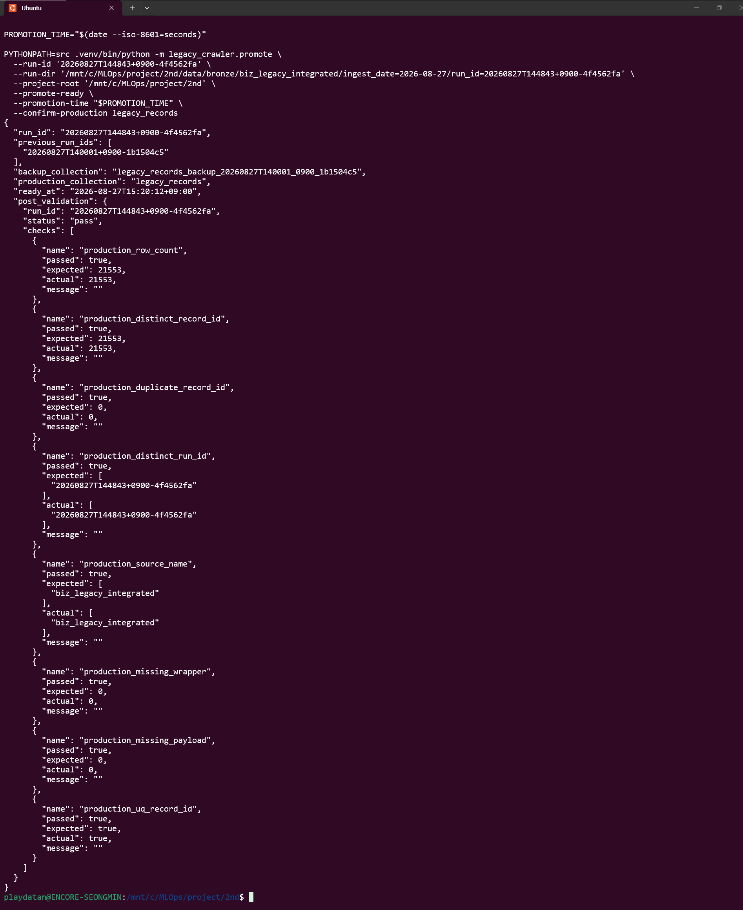
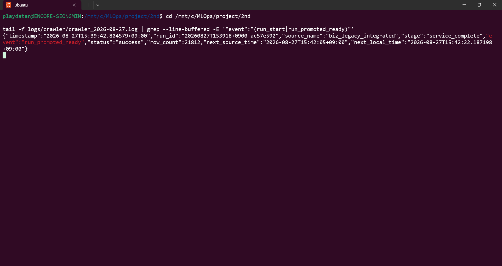

# 장애 대응 및 rollback

이 문서에서 JSON(JavaScript Object Notation, 자바스크립트 객체 표기법)과 CSV(Comma-Separated Values, 쉼표 구분 값) 산출물을 함께 추적한다.

## 기본 원칙

- `run_id` 하나로 파일과 MongoDB 계보를 연결한다.
- production 장애에서도 데이터를 즉시 삭제하지 않는다.
- 실패 staging과 failed production은 증빙 및 디버깅을 위해 보존한다.
- collection 정리는 대상 목록을 먼저 출력하고, 알려진 정확한 이름만 수동 승인 후 수행한다.
- `dropTarget=true`를 사용하지 않는다.

## 문제 추적 흐름

```text
run_id
  ↓
crawler_runs: 실행 단계, state, 건수, validation, error
  ↓
crawl_manifests: 수집·MongoDB·후속 pipeline 상태
  ↓
legacy_records 또는 파일 Bronze
  ↓
manifest.raw_artifacts / raw_path
  ↓
raw/page_0001.json ...
```

### 1. crawler_runs

```javascript
db.crawler_runs.findOne({ run_id: "<run_id>" })
```

`state`, `expected_rows`, `inserted_rows`, `validation.checks`, `error`, `failed_at`, `ready_at`, `staging_collection`을 확인한다.

### 2. crawl_manifests

```javascript
db.crawl_manifests.findOne({ run_id: "<run_id>" })
```

`status`, `mongodb_validation_status`, `pipeline_status`, `raw_artifacts`, 파일 경로와 checksum을 확인한다.

### 3. 파일 Bronze

```text
data/bronze/biz_legacy_integrated/ingest_date=<date>/run_id=<run_id>/
backup/bronze/biz_legacy_integrated/ingest_date=<date>/run_id=<run_id>/
```

파일 manifest의 `raw_artifacts`에 기록된 각 실제 파일 크기와 SHA-256(Secure Hash Algorithm 256-bit, 256비트 보안 해시 알고리즘)을 비교한다. 마지막 Raw JSON의 `has_more=false`도 확인한다.

## 단계별 대표 장애

| 단계 | 확인 사항 | 처리 |
| --- | --- | --- |
| API(Application Programming Interface, 애플리케이션 프로그래밍 인터페이스) metadata | 정확한 `source_name` dataset 존재 여부, timestamp timezone | 응답 계약이 다르면 추측하지 않고 run 실패 |
| pagination | signed cursor loop, 중간 page 재시도 소진, 마지막 `has_more` | 일부 page를 성공으로 간주하지 않음 |
| Raw/CSV | 파일 존재, size/checksum, BOM(Byte Order Mark, 바이트 순서 표식), 행·열 | publish하지 않고 실패 증빙 유지 |
| MongoDB insert | staging 이름, unique index, inserted count | production에는 쓰지 않고 staging 유지 |
| validation | 누락 key와 빈 문자열 구분, source hash 보존 | 하나라도 실패하면 승격 금지 |
| promotion | lock, backup target 충돌, rename 권한 | production 삭제 없이 중단 또는 rollback |
| READY | production 단일 run과 대상 run 일치 | 사후 검증 전 READY 금지 |
| systemd | `is-enabled`, `is-active`, journal, process exit code | 실패 원인을 보존하고 `Restart=on-failure` 동작 확인 |

## READY → READY 승격 증빙

일반 운영 승격은 `promote_ready_to_ready()`와 `--promote-ready`로 구현되어 있다. 아래 화면은 기존 READY production을 backup으로 보존하고 새 staging을 production으로 rename한 뒤 row count, distinct/duplicate `record_id`, 단일 run/source, wrapper/payload와 unique index 사후 검증이 모두 PASS한 시점의 증빙이다. 화면 속 run_id와 row count는 당시 값이며 현재 production 고정값이 아니다.



## production 승격 실패 rollback

승격 후 production 사후 검증이 실패하면 다음 순서로 복구한다.

```text
새 legacy_records
→ legacy_records_failed_{safe_new_run_id}

legacy_records_backup_{safe_old_run_id}
→ legacy_records

crawler_runs.state
→ failed
```

새 production을 failed collection으로 보존한 뒤 backup을 복원한다. 실패 collection은 자동 삭제하지 않는다. rollback 도중에도 target 존재 여부를 확인하고 `dropTarget`을 사용하지 않는다.

최초 mixed migration의 rollback backup은 일반 이름이 아니라 다음 형태다.

```text
legacy_records_backup_legacy_mixed_16runs_{promotion_timestamp}
```

이를 복원하면 구형 mixed production이 새 단일 READY 계약을 충족하지 않더라도 승격 전 상태를 정확히 되돌린 정상 rollback으로 본다. 이 경우 팀의 신규 pipeline 사용은 즉시 중단한다.

## lock 장애

`state/crawler.lock` 또는 `state/promotion.lock`이 있으면 해당 PID(Process Identifier, 프로세스 식별자)와 실제 process 실행 여부를 확인한다. 다른 process가 실행 중이면 기다린다. 비정상 종료가 확정된 경우에만 운영 승인 후 stale lock을 수동 정리한다.

## systemd 장애와 재시작 복구

```bash
systemctl is-enabled legacy-crawler.service
systemctl is-active legacy-crawler.service
systemctl status legacy-crawler.service --no-pager -l
journalctl -u legacy-crawler.service -n 100 --no-pager
```

정상 상태는 `enabled`, `active`다. cycle이 실패하면 runner는 non-zero로 종료하고 systemd의 `Restart=on-failure`, `RestartSec=10`이 재시작을 담당한다. 내부 무한 retry는 없다.

수동 restart가 필요하면 먼저 현재 promotion 진행 여부와 lock을 확인한다. SIGTERM을 받은 runner는 production rename을 강제로 중단하지 않고 기존 승격 또는 rollback이 끝나는 안전 경계에서 종료한다.

```bash
systemctl restart legacy-crawler.service
systemctl status legacy-crawler.service --no-pager -l
```

restart 뒤에는 새 `run_start`와 최종 `run_promoted_ready`, `status=success`를 로그에서 확인한다. 아래 화면은 restart 후 자동 cycle이 다시 READY까지 완료된 증빙이다.



## 실패 staging 정책

실패 staging은 자동 삭제하거나 7일 retention scheduler로 정리하지 않는다. 다음을 확인한 뒤 수동 승인으로만 삭제한다.

1. 정확한 collection 이름과 run_id
2. `crawler_runs.state=failed` 여부
3. 파일 Bronze 또는 실패 증빙 보존 여부
4. production 및 rollback backup이 대상 목록에 포함되지 않았는지
5. 담당자의 삭제 승인

## 수동 보존 및 정리 대상

다음 collection 종류는 자동 삭제하지 않는다.

- 매 자동 cycle의 직전 READY backup: `legacy_records_backup_{safe_old_run_id}`
- 최초 migration의 mixed rollback backup: `legacy_records_backup_legacy_mixed_16runs_{timestamp}`
- 실패 또는 검증 증빙 staging: `legacy_records_staging_{safe_run_id}`
- 사후검증 실패 production: `legacy_records_failed_{safe_new_run_id}`

상시 승격으로 backup collection은 누적될 수 있다. 삭제 필요성이 생기면 실제 collection 목록, 용도, 문서 수, run_id, 복구 가능성을 다시 보고하고 수동 승인을 받은 후 정확한 이름으로 처리한다. mixed rollback backup과 기존 검증 증빙 staging도 당장 삭제하지 않는다.

## rollback 후 확인

- `legacy_records` 문서 수와 distinct run/source 상태
- 복구된 collection의 기존 index 유지 여부
- 신규 failed collection의 문서 수와 `uq_record_id` 유지 여부
- `crawler_runs.state=failed`
- 팀 pipeline 중단 여부
- lock 해제 여부
- 로그와 오류 증빙 보존 여부
